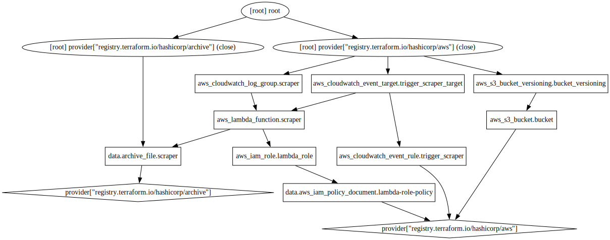

# car-scraper-v2

A project to scrape and store used car data, hosted in AWS using Infrastructure as Code.

## Technologies Used

* Node.js
* PostgreSQL
* Terraform
* AWS Lambda
* Amazon EventBridge
* Amazon Cloudwatch
* Amazon S3

## Terraform Infrasturcture

Output of `terraform graph` command:

